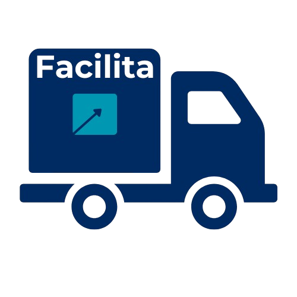

# Facilita 🚚

Link do projeto:
<a> https://leoo468.github.io/intermediacao-transporte/</a>

> A Facilita é um projeto acadêmico desenvolvido com o intuito de intermediar e facilitar o processo de frete entre clientes e transportadoras.
### ⚙️ Ajustes e melhorias

O projeto ainda está em desenvolvimento e as próximas atualizações serão voltadas para as seguintes tarefas:

- [x] Dashboard funcional.
- [x] Sistema de login e cadastro funcional.
- [x] Sistema de temas.
- [x] Nota Fiscal.
- [ ] Chat.
- [ ] Melhorar a NFE (colocando valor de pedágios...).
- [ ] Implementar banco de dados.

## ❓Como funciona a Facilita?

- O cliente ou a transportadora se cadastram na plataforma;
- Após o cadastro o cliente ou a transportadora tem acesso a dashboard;
- Dentro da dashboard o cliente coloca sua necessidade de frete, colocando destino, origem, tipo de carga...;
- As empresas mandam suas propostas sobre a necessidade dos clientes;
- Após o cliente aceitar a proposta, todo o processo é feito realizado de forma transparente e fácil.

## 🤝 Criador do projeto:

<table>
  <tr>
    <td align="center">
      <a href="#" title="defina o título do link">
         
        
          <b>Leonardo Macri</b>
        
      </a>
    </td>
  </tr>
</table>

## 😄 Obrigado por ler até aqui :D

###

###
